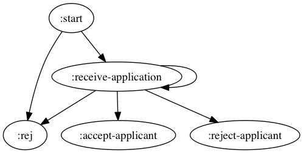

# stately


## Status

*pre* pre alpha quality. More of an idea than anything useful at this point. Use
at your own risk

This readme is a work in progress as well.  I will update as time allows

### next steps
* testing -- in progress
* better examples -- on deck

## Rationale

Over the course of my career I have come across numerous scenarios that involve
managing a lifecycle of side effects that are related to domain entities.
The most frequent manifestation of this scenario that I have seen is writing cron
jobs, or polling a database to look for domain entity `X` and do `Y` with it, e.g.
notify a user or update some attribute. These are your "batch jobs" or
"workflows".

One of the problems I have consistently run into in this scenario is
that I wind up with a muddled bunch of spaghetti code born out of trying
to manage the lifecycle of `X` doing `Y` *and* handle the side effects
simultaneously.  I have had this blow up on me a sufficient number of times
to write this library in anger.

Stately is a collection of protocols that allows you to build up a
Finite State Machine (FSM) to manage the state of these side effect lifecycles in
terms of the domain entity itself and allows you to advance through those stages
without the need for batch jobs. It also offers a separation of concerns of
managing that lifecycle and handling the side effects of that life cycle by handing
control of handling the side effects of these lifecycle state transitions over to
a separate mechanism outside of state management.

## Usage


### Necessary Core Components
Stately provides the building blocks, the usage is entirely up to you.
Stately needs a few things to be useful.
* something that implements `stately.components.state-store/StateStore`
* something that implements `stately.components.data-store/DataStore`
* something that implements `stately.components.executor/Executor`
* something that implements `stately.machine.state-machine/IStateMachine`
* a handle state function.  I choose to implement this as a 4-arity
  multi-method dispatched on state in my `SimpleStately` impl.
* a data function.  A function, given the core and a reference, knows
  how to find the data needed to complete the task at hand

These are the building blocks will make up a `stately.core/IStatelyCore`,
The `IStatelyCore` will be our bridge from our FSM to communicating with
the rest of the system.

I have provided some basic examples of these implementations, but these could be
extended to anything that fulfills those protocols.  For the stores, I imagine I
will be throwing something together to hook this up to Datomic fairly soon (see tests).

### Nodes

Nodes represent individual states in the lifecycle of an entity.
a Stately state machine is, at its core, a Directed Graph, and the nodes
are the vertices. There is documentation [here](src/stately/graph/nodes.clj)
in the code.  I have also helper fns for creating what I consider to be the
most useful type of nodes.

### StateMachine

The StateMachine derives a digraph from a map of node names to node definitions.
the machine uses the graph to enforce the invariant of a state machine.

a basic example of creating one would be:

```clojure
(def nodes {:start start-node-default
            :foo   foo-node-def
            :bar   bar-node-def})

(stately.machine.state-machine/make-machine nodes)
```


### Stately

The `stately.core/IStately` protocol is the link between an individual domain
entity and the state machine in IStatelyCore.  There is an implemenation
via `stately.core/SimpleStately` and can be invoked by passing and `IStateCore`
and a reference to a domain entity a-la `(stately.core/->SimpleStately core ref)`.


at a high level, this works as follows

```clojure
(defn simple-data-fn [data-store ref]
  (get  @data-store ref))

(defmulti handle-state
  (fn [_ new-state _ _] new-state))

;;... define impl of handlers here

(def nodes {:start start-node-default
            :foo   foo-node-def
            :bar   bar-node-def})

(def machine (stately.machine.state-machine/make-machine nodes))

(defrecord ExampleStatelyCore [data-atom state-atom executor-pool]
  stately.core/IStatelyCore
  (state-machine [this] machine)
  (handle-state-fn [this] handle-state)
  (data-fn [this] simple-data-fn)
  (data-store [this] (stately.components.data-store/->AtomDataStore data-atom))
  (state-store [this] (stately.components.state-store/->AtomStateStore state-atom))
  (executor [this]
    (stately.components.executor/->BasicJavaExecutor executor-pool)))

(def example-core
  (->ExampleStatelyCore (atom {}) (atom {}) (Executors/newScheduledThreadPool 2))) 


;; now you have something you can send events to

(-> (stately.core/stately example-core my-data-reference)
    (stately/input my-event))
```

### Complete Examples
I have also provided a very basic example in the `dev/college-application` and
`dev/user` namespace, based on a system created in `dev/mock-system` using the
provided atom store impls. There is also an analogous example of the same
functionality based on datomic in the tests in the `util`, `core`, and
`resumable-executor` namespaces.  

to see it in action, repl in and

```clojure
(go)
(run-everyone)
```

you will have ~30 seconds to poke around using the functions in the user NS to see
what is going on in the state store, data store, etc...

### Visualizing your state machine

You can use looms visualization utilities, if you have GraphViz installed.  A
Vizualization of the example in the dev namespace would look as follows

```clojure
(require '[loom.io :as io])

(require '[stately.graph.directed-graph :as dg])

(io/view (dg/graph (:graph college-application/machine)))
```

Which yields




### What happens when I stop and start a system?  Do I lose everything?

There is a function in `stately.core`, `stately.core/bootstrap-executor` that
takes an implementation of `stately.core/IStatelyCore` as its sole argument.  This
will load the states persisted in the core's `StateStore` impl into the cores executor,
accounting for the time delta between when the state was transacted and the current
time.  I would highly recomend leveraging Stuart Sierras component pattern here and
building that into the lifecycle of the component in `start`.  


## Acknowledgments

### Standing on the shoulders of giants

* this library is the product of a lot of work with and many discussions with
both Ian Eslick and Adrian Medina. While born out of trying to solve a very
specific problem in my work with them, I saw the possibility to solve a more
general problem.  Thanks guys.

* Thanks to [aysylu](https://github.com/aysylu) for providing [loom](https://github.com/aysylu/loom), which set me down the path of thinking about digraphs as abstractions for state machines, and provides the impls for them in stately.


## License

Copyright © 2015

Distributed under the Eclipse Public License either version 1.0 or (at
your option) any later version.
